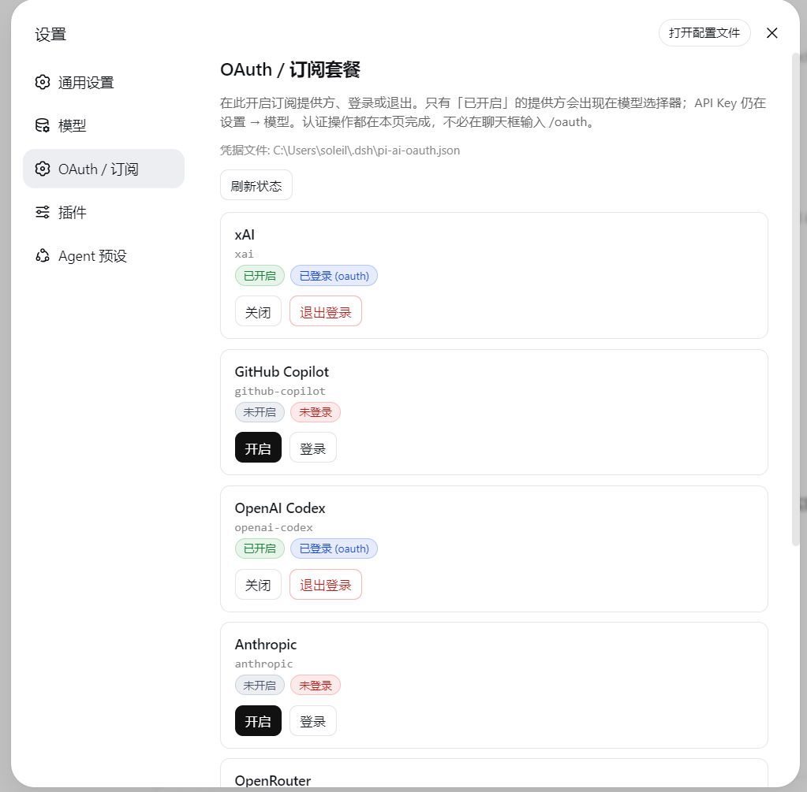
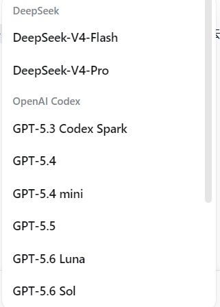
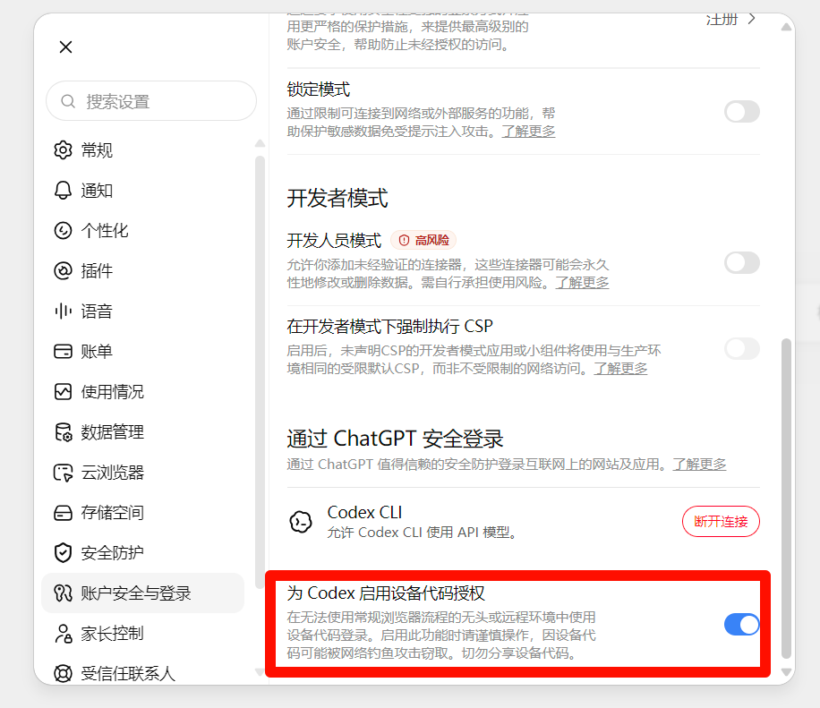

# dsh-llm-oauth

English | [中文](README.zh.md)

Standalone **OAuth / subscription-plan** LLM plugin for [DeepSeek Harness](https://github.com/deepseek-ai/deepseek-harness). Install it into your own profile with `dsh plugin add` — it does **not** patch the Harness repo.



Official `dsh-llm-pi-ai` authenticates with API keys only and never runs an OAuth login or refresh. This plugin reuses the same catalog package, [`@earendil-works/pi-ai`](https://www.npmjs.com/package/@earendil-works/pi-ai), but constructs `Models` with a durable `CredentialStore` so subscription tokens refresh on the request path.

Packaging follows the official plugin guides — [your first plugin](https://github.com/deepseek-ai/deepseek-harness/blob/master/docs/user/develop/basic/index.md) and [publish / install](https://github.com/deepseek-ai/deepseek-harness/blob/master/docs/user/develop/basic/publish.md):

- `package.json` → `dsh.bundle.patch` plus optional `dsh.client` (Web Settings face)
- `cordis.patch.yml` inserts one plugin row
- `prepare` bundles `src/` → `lib/` (including `lib/client.js`) on git install
- function plugin: export `name`, `inject`, `Config`, `apply` — **no `export default`**

## Providers

| Subscription | Provider id | Notes |
|---|---|---|
| Grok (SuperGrok / X Premium) | `xai` | Catalog currently lists Grok **4.3 / 4.5** (and Grok Build). **Grok 4.6 is not available yet** — pi-ai has not published it. |
| GitHub Copilot | `github-copilot` | Optional Enterprise URL defaults to public `github.com`. |
| ChatGPT / Codex plan | `openai-codex` | **Not** the `openai` API-key route. Needs device-code authorization enabled in ChatGPT — see below. |
| Anthropic subscription | `anthropic` | |
| OpenRouter | `openrouter` | Large catalog — enable only if you need it. |
| Kimi For Coding | `kimi-coding` | |

Model ids come from the installed `@earendil-works/pi-ai` catalog, not from this plugin. When that package adds Grok 4.6, bump the dependency here and rebuild.

## Enable vs sign-in

After install the plugin is **dormant**: the catalog lists the providers above, but **`providers: {}`**, so the model picker is **not** flooded with hundreds of models.

| Concept | Meaning | How |
|---|---|---|
| **Enable** | Register the LLM route; provider appears in the picker | Settings → **OAuth / Subscriptions**, `/oauth enable xai`, or auto on login |
| **Sign in** | Store tokens in `pi-ai-oauth.json` | Settings panel, `/oauth login xai`, or `bin/login.mjs` |
| **Disable** | Remove from picker; **keep** stored tokens | Settings panel or `/oauth disable xai` |

Only **enabled** providers list models. They sit alongside API-key providers under Settings → **Models** once enabled.

## Install

```sh
dsh plugin --profile web add github:ziyou979/dsh-llm-oauth
```

From a local checkout:

```sh
dsh plugin --profile web add ./dsh-llm-oauth
```

Confirm the layer:

```sh
dsh --profile web --dump-config
```

A git install may ask you to allow `prepare` in the profile's `pnpm-workspace.yaml` (pnpm ≥10 refuses lifecycle scripts otherwise):

```yaml
allowBuilds:
  dsh-llm-oauth: true
```

## Settings → OAuth / Subscriptions

The Web UI adds a settings section (between **Models** and **Plugins**) with:

- Every catalog subscription provider
- Badges: enabled / disabled, signed-in / out, login-in-progress
- Actions: enable, disable, sign in, sign out (buttons on this page — no need to type `/oauth` in chat)
- Successful sign-in stores tokens and auto-enables the provider
- Device codes show on the page (with copy); authorization URLs open in a new tab, or via **Open authorization page** if the popup is blocked

Providers that ask “pick a login method” (e.g. `openai-codex`) auto-select **device code** on Web (browser login needs a local `:1455` callback). If you still see an interactive-prompt error, use `bin/login.mjs` in a terminal.

After a provider is enabled (and signed in), it also appears under Settings → **Models** next to API-key routes:



API-key providers stay curated under **Settings → Models**. OAuth enable + login live on this plugin’s page.

Host HTTP API (same-origin Web):

| Method | Path | Body |
|---|---|---|
| `GET` | `/dsh-llm-oauth/status` | — |
| `POST` | `/dsh-llm-oauth/enable` | `{ "provider": "xai" }` |
| `POST` | `/dsh-llm-oauth/disable` | `{ "provider": "xai" }` |
| `POST` | `/dsh-llm-oauth/login` | `{ "provider": "xai" }` |
| `POST` | `/dsh-llm-oauth/logout` | `{ "provider": "xai" }` |

## ChatGPT / Codex: enable device-code auth first

`openai-codex` on Web uses **device code**, not the localhost `:1455` browser callback. ChatGPT hides that flow until you turn it on:

1. Open [ChatGPT → Settings → Apps & connectors](https://chatgpt.com/) (or **Settings → Connectors / Codex**, depending on the current UI).
2. Find **Codex** and enable **Enable device code authorization for Codex**.
3. Come back here, click **Sign in** on `openai-codex`, then open the authorization URL and enter the code shown on the Settings page.



Without that toggle, the device page rejects the code even though this plugin already picked the device-code method.

## Login / commands

In the Web UI:

```
/oauth status
/oauth list
/oauth enable xai
/oauth login xai
/oauth disable xai
/oauth logout xai
```

`/oauth login` returns the authorization URL and user code immediately so the chat UI does not hang. Finish in the browser, then run `/oauth status` or refresh the Settings page. The poll continues in the background.

Credentials are stored at `$DSH_HOME/pi-ai-oauth.json` (default `~/.dsh/pi-ai-oauth.json`).

If you need a terminal (or a provider still requires an interactive prompt):

```sh
node bin/login.mjs --list
node bin/login.mjs xai
```

After a profile install:

```sh
node %USERPROFILE%\.dsh\profiles\web\node_modules\dsh-llm-oauth\bin\login.mjs xai
```

Or enable in `settings.yaml` without the UI:

```yaml
llm-oauth:
  providers:
    xai: {}
```

## Do not collide with llm-pi-ai

`dsh-base` mounts dormant `dsh-llm-pi-ai`. Declaring the same provider id under an `llm-pi-ai:` settings section throws `DUPLICATE_ADAPTER`.

- Subscription / OAuth → this plugin only
- API keys (DeepSeek, official OpenAI API) → `llm-deepseek` / `llm-pi-ai`

## Develop

```sh
pnpm install
pnpm test
pnpm run build
node bin/login.mjs --list
```

`@deepseek-ai/*` packages are peers supplied by the DSH profile. Unit tests (catalog / store / service) only need `@earendil-works/pi-ai`.

## Limits

- **Grok 4.6 is not listed** until `@earendil-works/pi-ai` ships it; this plugin does not maintain a private model table
- No image / vision path
- No full native replay signatures
- No in-browser OAuth callback server (device code / open URL)
- Plain OpenAI API and DeepSeek official stay on API keys
- Settings → **Models** curated editors still target API keys; OAuth enable + login live under **Settings → OAuth / Subscriptions**

## License

MIT
